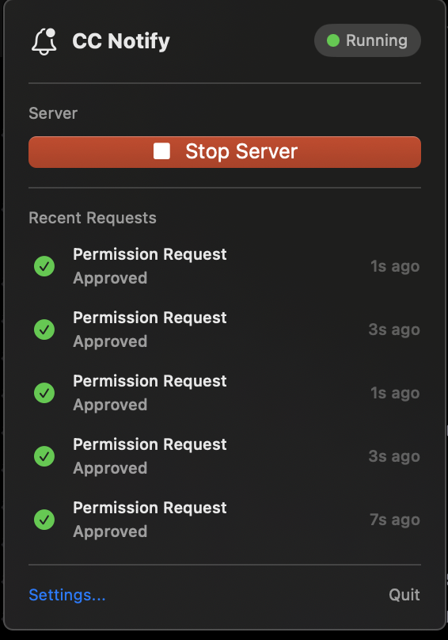
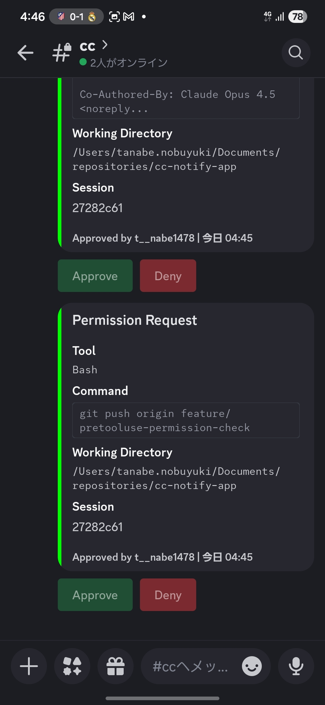
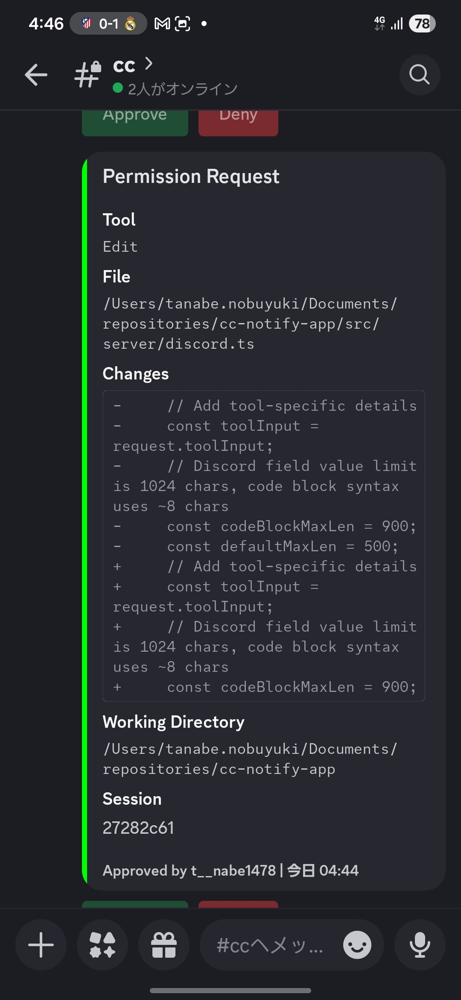

# cc-notify-app

[日本語](./README.ja.md)

A tool to send Claude Code permission requests to Discord and approve/deny them remotely.

## Overview

This tool integrates with Claude Code's `PermissionRequest` hook to intercept permission dialogs.
When Claude Code needs approval for a tool, the request is sent to Discord where you can approve or deny it remotely.

```
Claude Code  →  PermissionRequest Hook  →  Discord Bot  →  Discord
                                                              ↓
                                                        Button Click
                                                              ↓
Claude Code  ←  Hook Response          ←  WebSocket Server  ←  Discord Bot
```

## Screenshots

### macOS Menu Bar App


### Discord - Bash Command Request


### Discord - Edit Diff Display


## Features

- **Discord Approval**: Permission requests are sent to Discord for remote approval
- **Rich Display**: Shows diffs for Edit, commands for Bash, file paths for Write
- **Approve/Deny Buttons**: One-click approval or denial with optional reason
- **macOS Menu Bar App**: Easy server management from the menu bar
- **Timeout**: Falls back to local prompt after 10 minutes

## Setup

### 1. Create Discord Bot

1. Go to [Discord Developer Portal](https://discord.com/developers/applications)
2. Click "New Application" to create an app
3. Go to "Bot" tab and click "Reset Token" to copy the token
4. Go to "OAuth2" → "URL Generator" and select:
   - Scopes: `bot`
   - Bot Permissions: `Send Messages`, `Read Message History`
5. Use the generated URL to invite the bot to your server

### 2. Installation

```bash
git clone https://github.com/tanabe1478/cc-notify-app.git
cd cc-notify-app
pnpm install
pnpm build
```

### 3. Environment Variables

```bash
cp .env.example .env
```

Edit `.env`:

```
DISCORD_BOT_TOKEN=<Your Bot Token>
DISCORD_CHANNEL_ID=<Notification Channel ID>
```

How to get Channel ID:
1. Discord Settings → Advanced → Enable Developer Mode
2. Right-click on channel → "Copy ID"

### 4. Claude Code Hook Configuration

Add the following to your Claude Code settings:

#### Global Settings (All Projects)

Save to `~/.claude/settings.json`:

```json
{
  "hooks": {
    "PermissionRequest": [
      {
        "matcher": "",
        "hooks": [
          {
            "type": "command",
            "command": "/path/to/cc-notify-app/scripts/hook-wrapper.sh",
            "timeout": 600
          }
        ]
      }
    ]
  }
}
```

#### Per-Repository Settings

Create `.claude/settings.json` or `.claude/settings.local.json` in your project root:

| File | Purpose |
|------|---------|
| `.claude/settings.json` | Shared with team (Git tracked) |
| `.claude/settings.local.json` | Personal use (add to .gitignore) |

## How It Works

The `PermissionRequest` hook is triggered when Claude Code needs permission to execute a tool.
Instead of showing a local dialog, the request is sent to Discord where you can approve or deny it remotely.

This works seamlessly with Claude Code's existing permission system:
- Tools in your `allow` list are executed without any prompt
- Tools in your `deny` list are rejected without any prompt
- Tools that require permission trigger the hook and are sent to Discord

## Usage

### 1. Start the Server

#### macOS App (Recommended)

Menu bar app to manage the server:

```bash
# Build
cd macos/CCNotify
xcodegen generate
xcodebuild -scheme CCNotify -configuration Release build

# Copy app to Applications
cp -r ~/Library/Developer/Xcode/DerivedData/CCNotify-*/Build/Products/Release/CC\ Notify.app /Applications/
```

Click the bell icon in the menu bar and select "Start Server".

#### Command Line

```bash
cd /path/to/cc-notify-app

# Development mode
pnpm dev:server

# Production mode
pnpm start:server
```

### 2. Use Claude Code

Use Claude Code as usual. When a permission request occurs, a notification will be sent to Discord.

### 3. Approve/Deny on Discord

- **Approve**: Green button - Grant permission
- **Deny**: Red button - Reject (shows modal for optional reason)

## Background Execution (Command Line)

### macOS (launchd)

`~/Library/LaunchAgents/com.cc-notify-app.plist`:

```xml
<?xml version="1.0" encoding="UTF-8"?>
<!DOCTYPE plist PUBLIC "-//Apple//DTD PLIST 1.0//EN" "http://www.apple.com/DTDs/PropertyList-1.0.dtd">
<plist version="1.0">
<dict>
    <key>Label</key>
    <string>com.cc-notify-app</string>
    <key>ProgramArguments</key>
    <array>
        <string>/path/to/node</string>
        <string>/path/to/cc-notify-app/dist/server/index.js</string>
    </array>
    <key>WorkingDirectory</key>
    <string>/path/to/cc-notify-app</string>
    <key>EnvironmentVariables</key>
    <dict>
        <key>DISCORD_BOT_TOKEN</key>
        <string>your_token</string>
        <key>DISCORD_CHANNEL_ID</key>
        <string>your_channel_id</string>
    </dict>
    <key>RunAtLoad</key>
    <true/>
    <key>KeepAlive</key>
    <true/>
    <key>StandardOutPath</key>
    <string>/tmp/cc-notify-app.log</string>
    <key>StandardErrorPath</key>
    <string>/tmp/cc-notify-app.error.log</string>
</dict>
</plist>
```

```bash
launchctl load ~/Library/LaunchAgents/com.cc-notify-app.plist
```

### Linux (systemd)

`~/.config/systemd/user/cc-notify-app.service`:

```ini
[Unit]
Description=Claude Code Discord Notification Server
After=network.target

[Service]
Type=simple
WorkingDirectory=/path/to/cc-notify-app
ExecStart=/path/to/node /path/to/cc-notify-app/dist/server/index.js
Environment=DISCORD_BOT_TOKEN=your_token
Environment=DISCORD_CHANNEL_ID=your_channel_id
Restart=always
RestartSec=10

[Install]
WantedBy=default.target
```

```bash
systemctl --user enable cc-notify-app
systemctl --user start cc-notify-app
```

## Environment Variables

| Variable | Required | Default | Description |
|----------|----------|---------|-------------|
| `DISCORD_BOT_TOKEN` | Yes | - | Discord Bot token |
| `DISCORD_CHANNEL_ID` | Yes | - | Notification channel ID |
| `WEBSOCKET_PORT` | No | `3847` | WebSocket server port |
| `CC_NOTIFY_WS_URL` | No | `ws://localhost:3847` | WebSocket URL for hook |
| `CC_NOTIFY_TIMEOUT` | No | `600000` | Timeout in milliseconds |

## Development

```bash
# Run tests
pnpm test

# Build
pnpm build

# Start server in dev mode
pnpm dev:server

# Test hook manually
echo '{"session_id":"test","cwd":"/tmp","permission_mode":"default","hook_event_name":"PermissionRequest","tool_name":"Bash","tool_input":{"command":"ls"}}' | ./scripts/hook-wrapper.sh
```

## License

MIT
